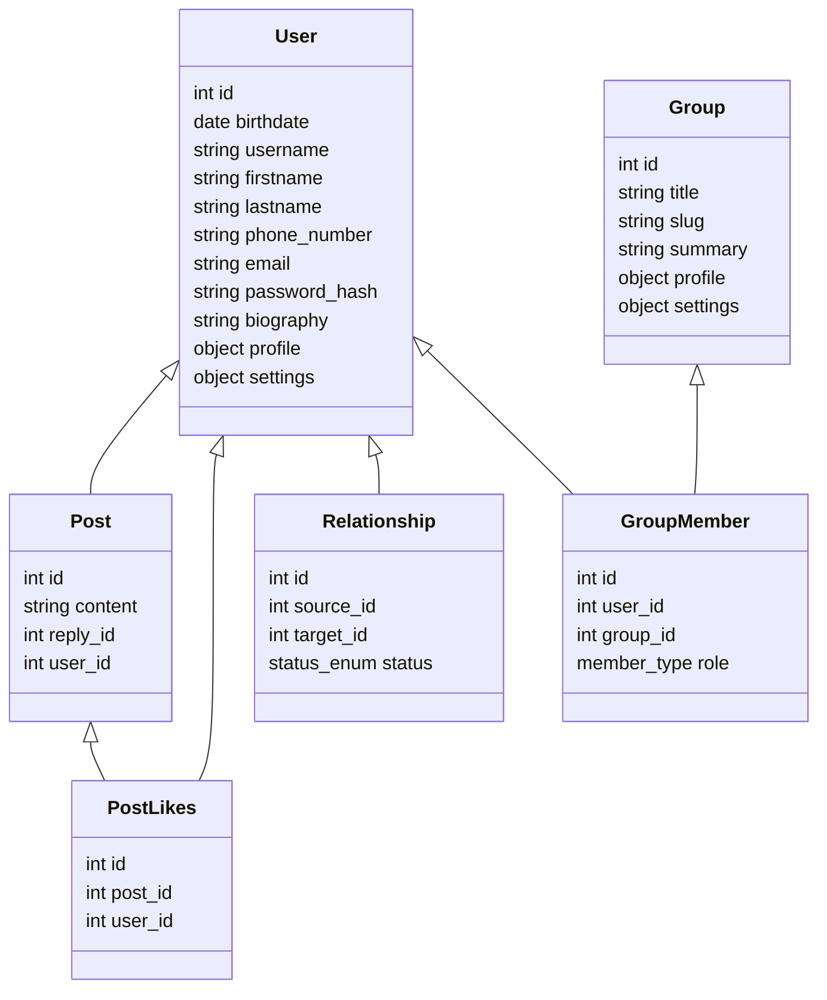

# 

This is the general backend server code for the Fairfield Programming Association. All of the code in this project is licensed under the [ISC License](https://opensource.org/licenses/ISC)- all contributions are welcome.

## Code and API Reference

Since this is a community-aided project, we thought it would be simplier if everyone knew what each of the objects in the database were. On top of this, we included the properties that each object should have, along with their relationship to other objects.

If you have any questions about this model, or have a change to suggest, please make an issue on Github.

### API Objects

#### Status Enum

- Request
- Rejected
- Active
- Blocked
