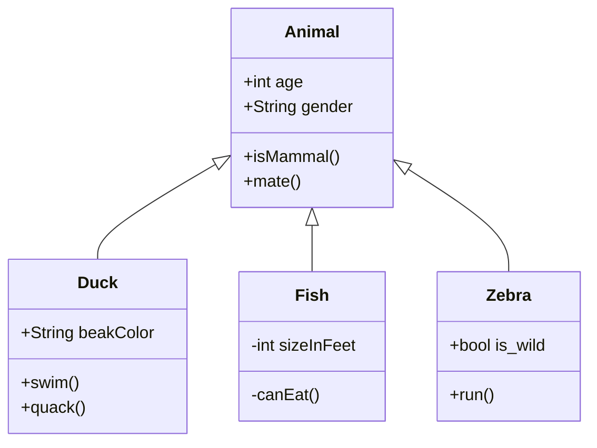

# 

This is the general backend server code for the Fairfield Programming Association. All of the code in this project is licensed under the [ISC License](https://opensource.org/licenses/ISC)- all contributions are welcome.

## Code and API Reference

### API Objects

